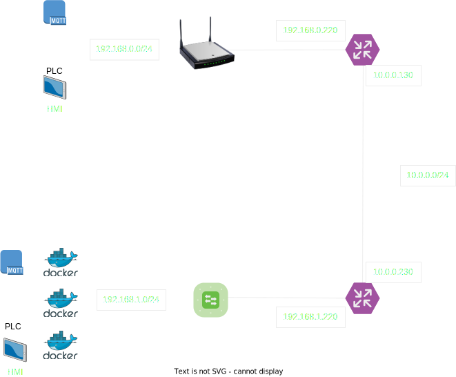

# Networking

## TLDR

- Description of the networking solution.
- Initially a site-to-site vpn connects the virtual interface and the docker cloud.
- Strongswan is preferred due to the good documentation.

[TOC]

# Architecture

This is the architecture for the solution:

# Details

